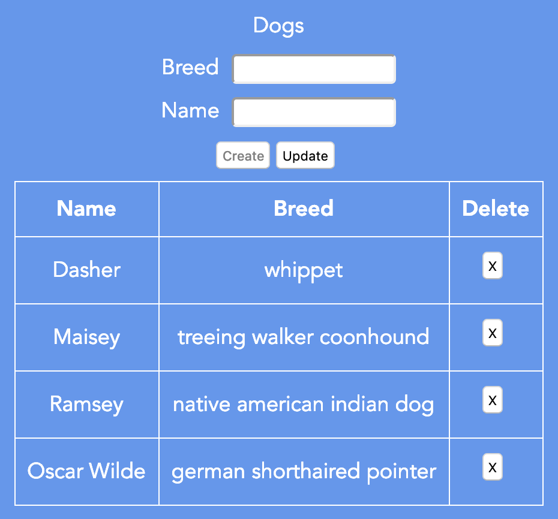

# fetch-api-demo

This is a web application (in Vue), REST server (Node.js and Express),
and database (PostgreSQL) that demonstrates using the Fetch API.



## Steps to build and run server

Install the Postgres database server.
On a Mac this can be done with `brew install postgresql`
assuming homebrew is installed.

```bash
# Initialize the database.
sudo mkdir /usr/local/pgsql
sudo chown {your-user-name} /usr/local/pgsql
initdb -D /usr/local/pgsql/data

# Start the Postgres server.
pg_ctl -D /usr/local/pgsql/data start

# Create the "postgres" user.
create user postgres (enter "postgres" for the password)

cd server

# Install all the server dependencies.
npm install

# Create/recreate database tables - This loses existing data!
npm run dbsetup (recreates database tables)

# Start Express server.
npm start
```

## Steps to build and run client

cd to the top project directory.

```bash
# Install all the client dependencies.
npm install

# Start the local web server.
npm run serve
```

browse localhost:8080

